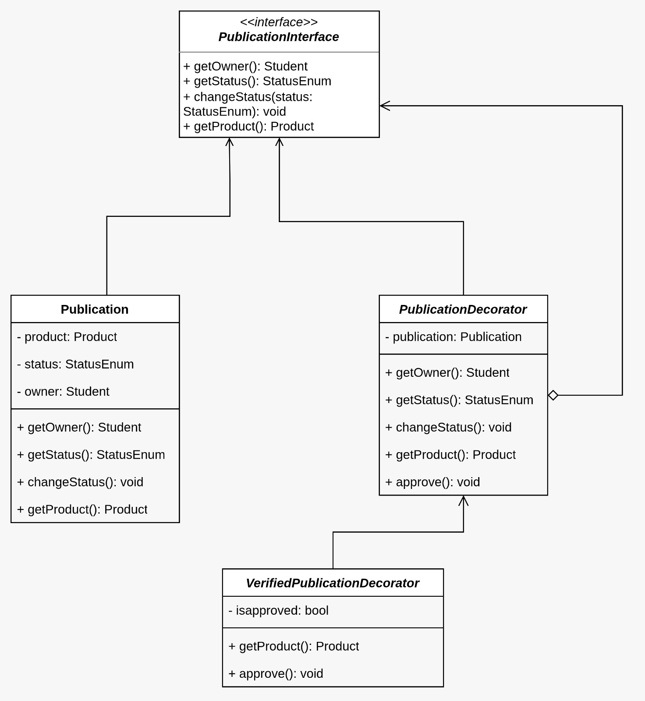

# 3.2.4. Decorator

## **1. Padrão GOF Decorator**

O **Decorator**, categorizado como um padrão **estrutural** pela Gang of Four (GoF), possibilita a adição de novas responsabilidades a um objeto de maneira dinâmica, sem alterar sua estrutura original. Esse padrão oferece mais flexibilidade que a herança, permitindo a composição de funcionalidades de forma incremental por meio do encapsulamento de objetos decorados.

Neste projeto, o padrão foi aplicado para ampliar a exibição de produtos para troca/venda, incluindo informações como comentários, avaliações e status do produto. Isso permitiu expandir o comportamento da interface de exibição sem modificar a classe base que representa o produto, favorecendo a reutilização de código e a adesão ao princípio aberto/fechado (Open/Closed Principle) da programação orientada a objetos.

## **2. Metodologia**

A metodologia desse artefato seguiu as seguintes etapas:

**1.** Análise do diagrama de classes: Após o estudo do conteúdo, o diagrama de classes, produzido anteriormente, foi analisado pelos integrantes com a intenção de identificar onde o padrão GoF Decorator poderia ser aplicado.

**2.** Elaboração do diagrama: Após decidida a classe a ser trabalhada (`Publicacao`), foi produzido o diagrama, com a ferramenta draw.io, considerando os princípios do Decorator, tal como as necessidades do projeto.

**3.** Desenvolvimento do código: Considerando o diagrama elaborado, foi feita a implementação do código de maneira compreensível e organizada no sistema.

**4.** Testes de execução do Decorator: Após a implementação do código, foram realizados testes para validar a aplicação do GoF ao projeto na classe `Publicacao`.

**5.** Documentação do artefato: Durante todo o desenvolvimento das etapas anteriores, os membros documentaram e aprimoraram as informações obtidas, formalizando o processo.

## 3. Participantes

Os participantes da implementação deste Padrão de Projeto estão descritos na tabela abaixo:

<p style="text-align: center;">Tabela 1: Participantes da implementação do Decorator</p>

|Matrícula | Aluno |
| -- | -- |
| 23/1011220  |  Davi Camilo       |
| 22/2015159  |  Lucas Guimarães   |

## **4. Modelagem do Decorator**

<font size="2"><p style="text-align: center"><b>Figura 1:</b> Diagrama do Decorator</p></font>

<p align="center">
  
</p>

<font size="2"><p style="text-align: center"><b>Fonte:</b> Lucas Guimarães e Davi Camilo</p></font>

## 5. Vídeo

<font size="2"><p style="text-align: center"><b>Vídeo 1:</b> Explicação e execução do Decorator</p></font>

<center>
<iframe 
  width="560" 
  height="315" 
  src="https://www.youtube.com/embed/xt7_haY2Gf8" 
  title="Decorator - AquiTemFCTE" 
  frameborder="0" 
  allow="accelerometer; autoplay; clipboard-write; encrypted-media; gyroscope; picture-in-picture; web-share" 
  allowfullscreen>
</iframe>
</center>

<font size="2"><p style="text-align: center"><b>Autor:</b> [Davi Camilo](https://github.com/Davicamilo23), 2025.</p></font>

**Link: https://youtu.be/xt7_haY2Gf8**

## **6. Informações Técnicas e Implementação**

A estrutura implementada pode ser vista abaixo:

### 6.1 Classe PublicationInterface e Publication

*`publication/models.py`*

```python
class PublicationInterface(ABC):
    @abstractmethod
    def get_owner(self):
        pass

    @abstractmethod
    def get_status(self):
        pass

    @abstractmethod
    def change_status(self, status):
        pass

    @abstractmethod
    def get_product(self):
        pass


class Publication(models.Model):
    owner = models.ForeignKey(User, on_delete=models.CASCADE)
    product = models.ForeignKey(Product, on_delete=models.CASCADE)
    status = models.CharField(max_length=10, choices=StatusEnum.choices, default=StatusEnum.PENDING)

    def get_owner(self):
        return self.owner

    def get_status(self):
        return self.status

    def change_status(self, status):
        self.status = status
        self.save()

    def get_product(self):
        return self.product

    def __str__(self):
        return f"{self.product.name} ({self.status})"
```

### 6.2 Classe PublicationDecorator e VerifiedPublicationDecorator

*`publication/models.py`*

```python
class PublicationDecorator(PublicationInterface):
    def __init__(self, publication: PublicationInterface):
        self._publication = publication

    def get_owner(self):
        return self._publication.get_owner()

    def get_status(self):
        return self._publication.get_status()

    def change_status(self, status):
        self._publication.change_status(status)

    def get_product(self):
        return self._publication.get_product()

    def approve(self):
        pass


class VerifiedPublicationDecorator(PublicationDecorator):
    def __init__(self, publication: PublicationInterface):
        super().__init__(publication)
        self.is_approved: bool = self._publication.get_status() == StatusEnum.APPROVED

    def get_product(self):
        if self._publication.get_status() != StatusEnum.APPROVED:
            raise PermissionError("Esta publicação ainda não foi aprovada.")
        return self._publication.get_product()

    def approve(self):
        self._publication.change_status(StatusEnum.APPROVED)
        self.is_approved = True
```

### 6.3 Testes

*`publication/tests.py`*

<details>
  <summary>Clique aqui para ver o código inteiro dos testes</summary>
  

```python

from django.test import TestCase
from django.contrib.auth.models import User
from .models import Product, Publication, StatusEnum, PublicationDecorator, VerifiedPublicationDecorator


class StatusEnumTestCase(TestCase):
    def test_status_enum_values(self):
        self.assertEqual(StatusEnum.PENDING, "PENDING")
        self.assertEqual(StatusEnum.APPROVED, "APPROVED")
        self.assertEqual(StatusEnum.REJECTED, "REJECTED")

    def test_status_enum_choices(self):
        choices = StatusEnum.choices
        self.assertEqual(len(choices), 3)


class PublicationModelTestCase(TestCase):
    @classmethod
    def setUpTestData(cls):
        cls.user = User.objects.create_user(username="testuser", password="testpass123")
        cls.product = Product.objects.create(name="Produto Teste", description="Descrição")

    def test_default_status_is_pending(self):
        publication = Publication.objects.create(owner=self.user, product=self.product)
        self.assertEqual(publication.status, StatusEnum.PENDING)

    def test_change_status(self):
        publication = Publication.objects.create(owner=self.user, product=self.product)
        publication.change_status(StatusEnum.APPROVED)
        publication.refresh_from_db()
        self.assertEqual(publication.status, StatusEnum.APPROVED)

    def test_get_methods(self):
        publication = Publication.objects.create(owner=self.user, product=self.product)
        self.assertEqual(publication.get_owner(), self.user)
        self.assertEqual(publication.get_status(), StatusEnum.PENDING)
        self.assertEqual(publication.get_product(), self.product)


class DecoratorPatternTestCase(TestCase):
    @classmethod
    def setUpTestData(cls):
        cls.user = User.objects.create_user(username="testuser", password="testpass123")
        cls.product = Product.objects.create(name="Produto Teste", description="Descrição")
    
    def setUp(self):
        self.publication = Publication.objects.create(owner=self.user, product=self.product)

    def test_decorator_wraps_publication(self):
        decorator = PublicationDecorator(self.publication)
        self.assertEqual(decorator._publication, self.publication)

    def test_decorator_delegates_methods(self):
        decorator = PublicationDecorator(self.publication)
        self.assertEqual(decorator.get_owner(), self.publication.get_owner())
        self.assertEqual(decorator.get_status(), self.publication.get_status())
        self.assertEqual(decorator.get_product(), self.publication.get_product())

    def test_decorator_change_status(self):
        decorator = PublicationDecorator(self.publication)
        decorator.change_status(StatusEnum.APPROVED)
        self.publication.refresh_from_db()
        self.assertEqual(self.publication.status, StatusEnum.APPROVED)


class VerifiedPublicationDecoratorTestCase(TestCase):
    @classmethod
    def setUpTestData(cls):
        cls.user = User.objects.create_user(username="testuser", password="testpass123")
        cls.product = Product.objects.create(name="Produto Teste", description="Descrição")
    
    def setUp(self):
        self.publication = Publication.objects.create(owner=self.user, product=self.product)

    def test_blocks_pending_publication(self):
        decorator = VerifiedPublicationDecorator(self.publication)
        with self.assertRaises(PermissionError):
            decorator.get_product()

    def test_blocks_rejected_publication(self):
        self.publication.change_status(StatusEnum.REJECTED)
        decorator = VerifiedPublicationDecorator(self.publication)
        with self.assertRaises(PermissionError):
            decorator.get_product()

    def test_allows_approved_publication(self):
        self.publication.change_status(StatusEnum.APPROVED)
        decorator = VerifiedPublicationDecorator(self.publication)
        product = decorator.get_product()
        self.assertEqual(product, self.product)

    def test_approve_method(self):
        decorator = VerifiedPublicationDecorator(self.publication)
        decorator.approve()
        self.publication.refresh_from_db()
        self.assertEqual(self.publication.status, StatusEnum.APPROVED)

    def test_decorator_extends_behavior(self):
        # Publicação original sempre funciona
        self.assertEqual(self.publication.get_product(), self.product)
        
        # Decorator adiciona verificação
        decorator = VerifiedPublicationDecorator(self.publication)
        with self.assertRaises(PermissionError):
            decorator.get_product()

    def test_maintains_other_methods(self):
        decorator = VerifiedPublicationDecorator(self.publication)
        self.assertEqual(decorator.get_owner(), self.user)
        self.assertEqual(decorator.get_status(), StatusEnum.PENDING)
```
</details>

## **7. Como Executar a Implementação**

### 7.1. Passos para Execução

**7.1.1. Clonar o repositório**

Abra o terminal e execute:

```bash
git clone https://github.com/UnBArqDsw2025-2-Turma02/2025.2_T02_G6_AquiTemFCTE_Entrega_03.git
```

**7.1.2. Acessar o diretório do projeto**

```bash
cd 2025.2_T02_G6_AquiTemFCTE_Entrega_03
```

```bash
cd GOFs/Estruturais/Decorator
```

**7.1.3. Criar um ambiente virtual (_venv_)**

- Linux/Mac:

```bash
python3 -m venv .venv
```

**7.1.4. Ativar o ambiente virtual**

- Windows:

```bash
venv\Scripts\activate
```

- Linux/Mac:

```bash
source .venv/bin/activate
```

**7.1.5. Instalar as dependências do projeto**

```bash
pip install -r requirements.txt
```

**7.1.6. Executar os testes da aplicação**

Rode o seguinte comando:

```bash
python manage.py test publication -v 2
```

## **8. Senso Crítico e Trabalho em Equipe**

A implementação do padrão **Decorator** no projeto AquiTemFCTE evidenciou a aplicação de **senso crítico** e **trabalho em equipe** no desenvolvimento de soluções modulares e flexíveis.

O senso crítico foi essencial na análise do problema, especialmente ao perceber a necessidade de adicionar responsabilidades extras a objetos sem alterar suas classes originais. Os membros responsáveis avaliaram cuidadosamente a complexidade do sistema, onde essa avaliação levou à escolha do padrão Decorator, que permite adicionar funcionalidades de forma dinâmica e controlada, alinhando-se aos princípios de baixo acoplamento e alta coesão.

O trabalho em equipe desempenhou papel fundamental durante todo o processo de implementação. A modelagem e o design da interface abstrata foram realizados de forma colaborativa, permitindo que os integrantes trabalhassem simultaneamente, e garantindo que cada membro da equipe fosse responsável por uma parte do projeto, mantendo a consistência e a escalabilidade.

## **9. Conclusão**

Em conclusão, a aplicação do padrão **Decorator** no projeto AquiTemFCTE, embora realizada dentro de um contexto prático de desenvolvimento de software, demonstrou a eficácia da composição dinâmica de funcionalidades para o processo de compra e venda de produtos. Através da utilização de um decorador, foi possível adicionar a ideia de aprovação da publicação pelo usuário dono, isso sem alterar a estrutura original das classes de produtos.

Essa implementação permitiu um modelo de arquitetura modular, onde a nova funcionalidade foi introduzida de forma isolada e controlada, garantindo que o sistema permanecesse extensível e fácil de manter. A atividade não só consolidou o entendimento do padrão Decorator, mas também contribuiu para tornar o código mais reutilizável, aderente aos princípios SOLID e alinhado com boas práticas de design orientado a objetos.

## **10. Referências**

> SERRANO, Milene, Arquitetura e Desenho de Software - Aula - GOFS ESTRUTURAIS. Disponível em: https://aprender3.unb.br/pluginfile.php/3178543/mod_page/content/1/Arquitetura%20e%20Desenho%20de%20Software%20-%20Aula%20GoFs%20Estruturais%20-%20Profa.%20Milene.pdf. Universidade de Brasília - UnB. Brasília. Acesso em 16 de outubro de 2025.

## Histórico de Versões
| Versão | Data | Descrição | Autor(es) | Revisor(es) | Detalhes da Revisão |
| -- | -- | -- | -- | -- | -- |
| 1.0 | 16/10/2025 | Desenvolvimento inicial do documento com Introdução, Participantes e referência | [Davi Camilo](https://github.com/Davicamilo23) | [Caio Sabino](https://github.com/caiomsabino) | Sem erros |
| 1.1 | 19/10/2025 | Adição da Metodologia, Modelagem do Decorator, Senso Crítico e Trabalho em Equipe e Conclusão no artefato | [Davi Camilo](https://github.com/Davicamilo23) | [Lucas Guimarães](https://github.com/lcsgborges) | Conteúdo coerente com o artefato, sem erros aparente |
| 1.2 | 20/10/2025 | Adição do Vídeo e Como Executar a Implementação | [Davi Camilo](https://github.com/Davicamilo23) | [Lucas Guimarães](https://github.com/lcsgborges) | Vídeo está coerente com o conteúdo apresentado e códigos executados com sucesso |
| 1.3 | 20/10/2025 | Adição dos códigos | [Lucas Guimarães](https://github.com/lcsgborges) | [Davi Camilo](https://github.com/Davicamilo23) | Código está de acordo com o apresentado|
