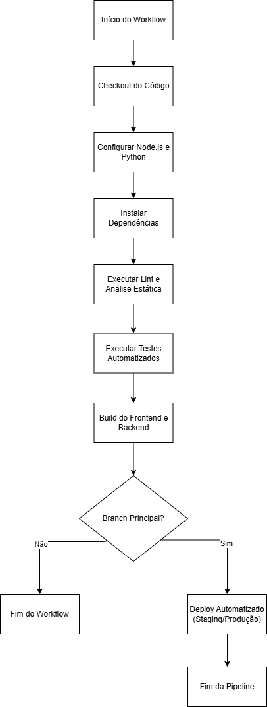

# 3.5.1 Planejamento de CI/CD

## 1. Introdução

Este documento apresenta o **planejamento do processo de Integração Contínua (CI)** e **Entrega Contínua (CD)** que poderá ser adotado no projeto **AquiTemFCTE**.

Embora esta etapa não envolva a implementação prática da pipeline, o objetivo é **documentar como o processo de CI/CD será estruturado**, quais etapas serão cobertas e como ele poderá ser aplicado futuramente no repositório hospedado no GitHub.

---

## 2. Conceitos Gerais

### 2.1 Integração Contínua (CI)

A **Integração Contínua** consiste na prática de integrar frequentemente o código desenvolvido em um repositório compartilhado. Cada push ou pull request aciona uma **esteira automatizada** de verificação que inclui:

- **Build automático** do projeto;
- **Execução de testes automatizados** (unitários e de integração);
- **Análise estática de código** (lint, tipagem e formatação);
- **Relatórios de status e notificações** no GitHub.

O objetivo principal é **detectar erros precocemente**, garantindo que o código enviado não quebre o build nem introduza regressões (Red Hat, 2025).
Esse processo pode ser facilmente automatizado por meio de _workflows_ baseados em eventos — como _push_, _pull request_ ou _cron jobs_ — permitindo verificar a integridade do projeto continuamente (GitHub, 2025).

### 2.2 Entrega Contínua (CD)

A **Entrega Contínua** complementa a CI ao automatizar o processo de **implantação (deploy)** da aplicação. Após a aprovação e merge na branch principal, o código poderá ser enviado automaticamente para:

- Um ambiente de **homologação (staging)** para validação;
- Um ambiente de **produção**, com controle de versões e rollback.

Esse modelo de entrega garante que cada alteração aprovada possa ser implantada de forma rápida e segura, proporcionando ciclos curtos de feedback e reduzindo riscos de falhas em produção (Red Hat, 2025).

Para o contexto do projeto, a CD poderá ser configurada para implantar:

- O **frontend React** no **Vercel** ou **GitHub Pages**;
- O **backend Django** em um **servidor EC2, Render ou Railway**.

---

## 3. Aplicação no Repositório

A estrutura do repositório GitHub será organizada da seguinte forma:

```
/
├── frontend/       # Aplicação React
├── backend/        # Aplicação Django
├── .github/
│   └── workflows/
│       └── ci.yml  # Pipeline de Integração Contínua
└── README.md
```

A pipeline será configurada para:

1. Executar automaticamente a cada **pull request** ou **push** nas branches principais (`main`, `develop`);
2. Rodar os testes de backend e frontend;
3. Validar formatação e lint (ESLint para React, Flake8 para Django);
4. Gerar artefatos de build e relatórios de status;
5. (Opcional) Fazer o deploy automatizado após merge na `main`.

---

## 4. Etapas da Pipeline Planejada

| Etapa                             | Descrição                                       | Ferramentas                                       | Resultado Esperado          |
| :-------------------------------- | :---------------------------------------------- | :------------------------------------------------ | :-------------------------- |
| **1. Checkout**                   | Obter o código do repositório                   | `actions/checkout@v4`                             | Código disponível no runner |
| **2. Configuração dos Ambientes** | Configura Node.js e Python                      | `actions/setup-node`, `actions/setup-python`      | Ambientes prontos           |
| **3. Instalação de Dependências** | Instala pacotes do frontend e backend           | `npm install`, `pip install -r requirements.txt`  | Dependências resolvidas     |
| **4. Lint e Análise Estática**    | Verifica padrões de código                      | `eslint`, `flake8`                                | Código limpo e padronizado  |
| **5. Testes Automatizados**       | Executa testes unitários e de integração        | `pytest`, `jest`                                  | Build validado              |
| **6. Build do Projeto**           | Gera artefatos (React build, migrations Django) | `npm run build`, `python manage.py collectstatic` | Aplicação pronta            |
| **7. Deploy (opcional)**          | Envio automático ao ambiente remoto             | `vercel`, `railway`, `docker push`                | Nova versão em execução     |

---

## 5. Fluxo da Pipeline

Este diagrama ilustra o fluxo principal da pipeline proposta, desde o gatilho inicial até a verificação condicional de branch e possível deploy automatizado.

<p align="center" style="font-size: 12;"><b>Figura 1:</b> Fluxo da Pipeline de CI/CD</p>

<div style="text-align: center;">



</div>

<p align="center" style="font-size: 12;"><small><b>Fonte:</b> Algusto Caldas e Eric Rabelo</small></p>

---

## 6. Exemplo de Possível Workflow

A seguir, um exemplo de configuração YAML para a pipeline de CI/CD utilizando GitHub Actions. Este arquivo deverá ser salvo em `.github/workflows/ci.yml` no repositório.

```yaml
name: CI/CD Pipeline

on:
  push:
    branches: [main, develop]
  pull_request:
    branches: [main, develop]

jobs:
  build:
    runs-on: ubuntu-latest

    steps:
      - name: Checkout do código
        uses: actions/checkout@v4

      - name: Configurar Node.js
        uses: actions/setup-node@v4
        with:
          node-version: 20

      - name: Configurar Python
        uses: actions/setup-python@v5
        with:
          python-version: "3.11"

      - name: Instalar dependências do frontend
        working-directory: ./frontend
        run: |
          npm install
          npm run lint

      - name: Instalar dependências do backend
        working-directory: ./backend
        run: |
          pip install -r requirements.txt
          flake8 .

      - name: Executar testes do backend
        working-directory: ./backend
        run: pytest

      - name: Executar testes do frontend
        working-directory: ./frontend
        run: npm test -- --watchAll=false

      - name: Build do frontend
        working-directory: ./frontend
        run: npm run build

      - name: Build e migrações do backend
        working-directory: ./backend
        run: |
          python manage.py collectstatic --noinput
          python manage.py makemigrations
          python manage.py migrate

      # Deploy (futuro)
      # - name: Deploy para Vercel / Render
      #   run: echo "Deploy automatizado após merge aprovado"
```

---

## 7. Conclusão

O planejamento da pipeline de CI/CD proposto neste documento fornece uma base sólida para a automação dos processos de integração, validação e entrega do sistema **AquiTemFCTE**.
A aplicação dos conceitos descritos permitirá que o time de desenvolvimento mantenha um **fluxo de trabalho confiável**, **reprodutível** e **padronizado**, reduzindo o risco de falhas e aumentando a eficiência nas entregas.

Além disso, a utilização de **GitHub Actions** como ferramenta central garante compatibilidade direta com o repositório do projeto e flexibilidade para futuras expansões — como a adição de testes de carga, verificação de segurança e deploy automatizado em múltiplos ambientes.
Este planejamento também reforça a importância das boas práticas DevOps, incentivando a integração contínua e o aprendizado colaborativo dentro da equipe.

---

## 8. Bibliografia

- Red Hat. _O que é uma pipeline de CI/CD?_ Red Hat, 2025. Disponível em: [https://www.redhat.com/pt-br/topics/devops/what-cicd-pipeline](https://www.redhat.com/pt-br/topics/devops/what-cicd-pipeline). Acesso em: 24 out. 2025.
- GitHub Docs. _Compreender as GitHub Actions._ GitHub, 2025. Disponível em: [https://docs.github.com/pt/actions/get-started/understand-github-actions](https://docs.github.com/pt/actions/get-started/understand-github-actions). Acesso em: 24 out. 2025.

---

## Histórico de Versão

| Versão | Data       | Descrição                                          | Autor(es)                                       | Revisor(es)                                     | Detalhes da revisão |
| :----- | :--------- | :------------------------------------------------- | :---------------------------------------------- | :---------------------------------------------- | :------------------ |
| 1.0    | 24/10/2025 | Criação e estruturação do documento de CI/CD       | [Eric Rabelo](https://github.com/rabelzx)       | [Algusto Caldas](https://github.com/Algusto-RC) | Revisado e Aprovado |
| 2.0    | 24/10/2025 | Adicionando diagrama do fluxo da pipeline de CI/CD | [Algusto Caldas](https://github.com/Algusto-RC) | [Eric Rabelo](https://github.com/rabelzx)       | Revisado e Aprovado |
