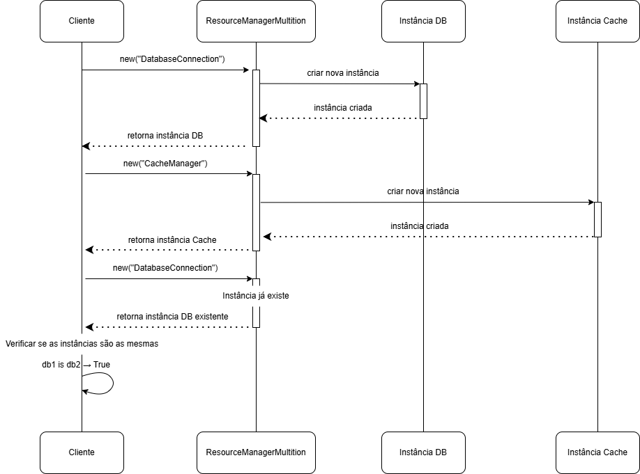

# 3.1.2. **Multiton**

## 1. Introdução

Este documento apresenta uma **demonstração acadêmica** do padrão de projeto **Multiton**, um padrão criacional do grupo **GoF** (Gang of Four). 

O padrão **Multiton** é uma extensão do padrão **Singleton** que, em vez de garantir uma única instância global, assegura que haja **uma única instância para cada chave específica**. Isso é ideal para cenários onde diferentes partes do sistema precisam de instâncias controladas, como em **sistemas escalados** e **microsserviços** (BLACKWASP, 2025).

Para ilustrar seu uso, este documento explora um **protótipo de microsserviço** que utiliza o Multiton para gerenciar diferentes tipos de recursos de forma independente e segura.

---

## 2. Metodologia e Desenvolvimento

Para fins **educacionais**, foi desenvolvido um **protótipo de microsserviço** em **Python** que simula o gerenciamento de recursos. A implementação segue os princípios da **Programação Orientada a Objetos (POO)** e as diretrizes de padrões criacionais.

Este protótipo demonstra como o padrão Multiton pode centralizar a lógica de gerenciamento de recursos, como conexões de banco de dados (`DatabaseConnection`) ou caches (`CacheManager`), garantindo que haja apenas uma instância para cada tipo de recurso. Essa abordagem é valiosa em **arquiteturas distribuídas** e de **microsserviços**, onde a gestão eficiente e a independência entre componentes são cruciais.

---

## 3. Estrutura do Protótipo

O código elaborado ilustra a aplicação do padrão Multiton, servindo como uma demonstração conceitual:

* **`ResourceManagerMultiton`**: A classe principal que garante uma única instância para cada tipo de recurso, como `"DatabaseConnection"` ou `"CacheManager"`, usando a chave `resource_type`.
* **`Resource`**: Uma classe que representa um recurso específico, como um banco de dados ou cache, gerenciado por uma instância do Multiton.

[Link para o script demonstrativo](https://github.com/UnBArqDsw2025-2-Turma02/2025.2_T02_G6_AquiTemFCTE_Entrega_03/tree/main/GOFs/Criacionais/Multiton/multiton_demo.py)

## 4. Diagramas do Protótipo

### 4.1. Diagrama de Classes

O diagrama abaixo ilustra a estrutura das classes do padrão Multiton e suas relações:

<b>Figura 1:</b> Diagrama de Classe

 

<small><b>Fonte:</b> Algusto Caldas e Eric Rabelo</small>

---

### 4.2. Diagrama de Sequência - Criação de Instâncias

Este diagrama mostra o fluxo de criação e reutilização de instâncias do Multiton:

<b>Figura 2:</b> Diagrama de Sequência

 

<small><b>Fonte:</b> Algusto Caldas e Eric Rabelo</small>

---

### 4.3. Diagrama de Componentes do Microsserviço

Representação da arquitetura do microsserviço utilizando o padrão Multiton:

<b>Figura 3:</b> Diagrama de Componentes do Microsserviço

 

<small><b>Fonte:</b> Algusto Caldas e Eric Rabelo</small>

---

### 4.4. Diagrama de Estados do Recurso

Representação dos estados pelos quais um recurso pode passar:

<b>Figura 4:</b> Diagrama de Estados do Recurso

 

<small><b>Fonte:</b> Algusto Caldas e Eric Rabelo</small>

---

### 4.5. Diagrama de Arquitetura Distribuída

Visão de como o Multiton funciona em um ambiente distribuído com múltiplos microsserviços:

<b>Figura 4:</b> Diagrama de Arquitetura Distribuída

 

<small><b>Fonte:</b> Algusto Caldas e Eric Rabelo</small>

---

### 4.6. Fluxo de Execução

Diagrama de fluxo mostrando a lógica de decisão na criação/recuperação de instâncias:

<b>Figura 4:</b> Diagrama de Arquitetura Distribuída

 

<small><b>Fonte:</b> Algusto Caldas e Eric Rabelo</small>

---

## 5. Vantagens do Padrão no Contexto de Microsserviços

### 5.1. Benefícios Demonstrados

1. **Controle de Instâncias**: Cada tipo de recurso tem apenas uma instância de gerenciamento
2. **Eficiência de Memória**: Evita duplicação desnecessária de gerenciadores
3. **Configuração Centralizada**: Configurações consistentes por tipo de recurso
4. **Isolamento**: Diferentes tipos de recursos são gerenciados independentemente
5. **Escalabilidade**: Facilita a adição de novos tipos de recursos

### 5.2. Aplicabilidade em Sistemas Reais

Este protótipo demonstra como o **Multiton** pode ser valioso em:

- **Gerenciamento de Conexões de Banco de Dados**
- **Pools de Cache Distribuído**
- **Filas de Mensagens**
- **Pools de Threads**
- **Gerenciadores de Configuração**

---

### 5.3. Gerenciamento de Memória

Em sistemas de longa duração, considerar:
- Limpeza de instâncias não utilizadas
- Monitoramento de uso de memória
- Estratégias de cache com TTL

---

## 6. Como Executar o Código

Para experimentar o protótipo do **padrão Multiton** na prática, siga os passos abaixo:

#### 6.1. Pré-requisitos

* **Python 3.8+** instalado no sistema
* Nenhuma biblioteca externa é necessária (todo o código usa apenas bibliotecas padrão)

#### 6.2. Execução

Abra o terminal ou prompt de comando no diretório onde o script está localizado e execute:

    python multiton_demo.py

####  6.3. Navegação no Menu Interativo

Ao iniciar, o programa exibe um **menu interativo** com várias opções:

| Opção | Descrição |
| --- | --- |
| **1** | Demonstração básica do padrão Multiton (conceito de instâncias únicas por tipo) |
| **2** | Simulação de uso em microsserviços (compartilhamento de recursos entre serviços) |
| **3** | Demonstração avançada com múltiplos tipos de recursos e configurações |
| **4** | Executa todas as demonstrações em sequência |
| **5** | Limpa todas as instâncias criadas e reinicia o estado do Multiton |
| **0** | Encerra o programa |

Durante a execução, o console mostrará mensagens de criação e reuso das instâncias, além de exibir o **status detalhado dos recursos** de cada tipo (como `DatabaseConnection`, `CacheManager`, etc.).

## 7. Demonstração do Código sendo Executado

<iframe width="560" height="315" src="https://www.youtube.com/embed/LkLBred92CE?si=qIgtSPH4hNlk0ABn" title="YouTube video player" frameborder="0" allow="accelerometer; autoplay; clipboard-write; encrypted-media; gyroscope; picture-in-picture; web-share" referrerpolicy="strict-origin-when-cross-origin" allowfullscreen></iframe>

---

## 8. Reflexão Crítica

Quando começamos a explorar o Multiton, confesso que a ideia de controle de instâncias não fazia muito sentido para nós no contexto do AquiTemFCTE. Tentávamos encaixar o padrão no projeto principal, mas não conseguíamos visualizar onde ele realmente agregaria valor. Foi aí que decidimos pensar fora da caixa.

Ao migrar para um mini projeto toy focado em microsserviços, tudo clareou. De repente, conseguimos ver na prática como o Multiton resolve um problema real: gerenciar múltiplas instâncias de forma controlada, onde cada tipo de recurso tem seu próprio gerenciador único. Diferente do Singleton que te prende a apenas uma instância total, o Multiton traz uma flexibilidade que faz muito mais sentido em arquiteturas modernas.

Essa experiência nos ensinou algo valioso: não existe bala de prata em arquitetura de software. Cada padrão tem seu contexto, seu momento certo de brilhar. O Multiton não era a solução para o AquiTemFCTE, mas é perfeito para sistemas que gerenciam diferentes categorias de recursos - como pools de conexão, caches distribuídos ou filas de mensagens. Aprendemos que temos um arsenal de soluções à disposição, e o segredo está em saber qual ferramenta usar para qual problema.

---

## 9. Conclusão

Este documento serviu como uma demonstração explicativa do padrão **Multiton**, utilizando um **protótipo educacional** para ilustrar como ele pode centralizar a gestão de recursos e promover **robustez**, **independência** e **segurança** em arquiteturas de microsserviços.

Os diagramas apresentados ilustram como o padrão **Multiton** pode ser estruturado em um contexto de microsserviço, demonstrando sua aplicabilidade em cenários de **sistemas escalados** que requerem **robustez**, **independência** e **segurança**.

O conteúdo tem finalidade **acadêmica** e não sugere a implementação deste padrão no projeto AquiTemFCTE.

---

## 10. Bibliografia

  * **BLACKWASP**. Multiton Design Pattern. Disponível em: [https://www.blackwasp.co.uk/multiton.html](https://www.blackwasp.co.uk/multiton.html). Acesso em: 13 out. 2025.
  * **SERRANO**, Milene. Arquitetura e Desenho de Software - Aula GoFs Criacionais. Universidade de Brasília. 2025. Disponível em: [https://aprender3.unb.br/pluginfile.php/3178542/mod_page/content/1/Arquitetura%20e%20Desenho%20de%20Software%20-%20Aula%20GoFs%20Criacionais%20-%20Profa.%20Milene.pdf](https://aprender3.unb.br/pluginfile.php/3178542/mod_page/content/1/Arquitetura%20e%20Desenho%20de%20Software%20-%20Aula%20GoFs%20Criacionais%20-%20Profa.%20Milene.pdf). Acesso em: 13 out. 2025.

---

## Histórico de Versões

| Versão | Data | Descrição | Autor(es) | Revisor(es) | Detalhes da revisão |
| :--- | :--- | :--- | :--- | :--- | :--- |
| 1.0 | 11/10/2025 | Inicialização do Documento | [Eric Rabelo](https://github.com/rabelzx) | [Algusto Caldas](https://github.com/Algusto-RC) | Revisado e Aprovado |
| 2.0 | 14/10/2025 | Integração dos diagramas ao documento principal | [Algusto Caldas](https://github.com/Algusto-RC) | [Eric Rabelo](https://github.com/rabelzx) | Revisado e Aprovado |
| 2.1 | 16/10/2025 | Inserção de Números dos tópicos | [Daniel Rodrigues](https://github.com/DanielRogs) | [Algusto Caldas](https://github.com/Algusto-RC) | Revisado e Aprovado |