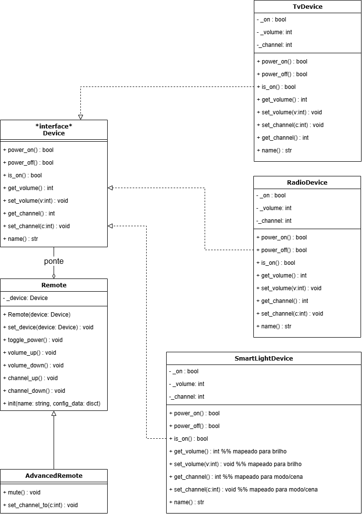

# 3.2.1. Bridge

## 1. Introdução

O padrão de projeto **Bridge** pertence ao grupo dos **padrões estruturais** propostos pela _Gang of Four (GoF)_, e tem como principal objetivo **desacoplar uma abstração de sua implementação**, permitindo que ambas possam evoluir de forma independente (GAMMA et al., 1995).  
Esse padrão é amplamente utilizado quando há a necessidade de evitar a rigidez causada pela herança direta, proporcionando maior **flexibilidade e extensibilidade** ao sistema (FREEMAN; FREEMAN, 2004).

A ideia central do Bridge é **separar a interface abstrata** (definindo o comportamento que o cliente espera) **da implementação concreta** (que realiza o comportamento específico). Isso é alcançado através de uma **ponte** que conecta os dois lados, tornando o código mais modular e de fácil manutenção (LARMAN, 2004).

## 2. Metodologia Adotada

Para o estudo e aplicação do padrão **Bridge**, adotou-se uma metodologia baseada na **análise conceitual e prática** dos princípios de design orientado a objetos descritos por Gamma et al. (1995), aliada à **comparação entre abordagens de herança e composição** conforme discutido em Freeman e Freeman (2004).  
A pesquisa compreendeu três etapas principais:

1. **Revisão teórica** dos conceitos estruturais do padrão Bridge;
2. **Identificação de um contexto de aplicação** no qual a separação entre abstração e implementação fosse relevante;
3. **Proposição e discussão da modelagem** com base em exemplos práticos de literatura e em experiências do grupo.

## 3. Exposição e Explicação da Modelagem

**Cenário de implementação (visão de domínio):**  
Desejamos um **controle remoto** único capaz de operar **múltiplos dispositivos** com capacidades semelhantes (ligar/desligar, ajustar intensidade/volume, trocar canal/estação/modo), porém com **detalhes internos diferentes**: uma **TV**, um **Rádio** e uma **Lâmpada Inteligente**. O sistema deve permitir:

- **Evolução independente em dois eixos**:
  - **Abstração (controles)**: `Remote` (básico) e `AdvancedRemote` (refinado, com comandos extras).
  - **Implementação (dispositivos)**: `TvDevice`, `RadioDevice`, `SmartLightDevice`.
- **Troca dinâmica** da implementação em tempo de execução (ex.: o mesmo controle passar da TV para o Rádio com um comando).
- **Capacidades adicionais apenas na abstração refinada** (ex.: `setch` e `mute` disponíveis somente em `AdvancedRemote`), sem alterar os dispositivos.

**Mapeamento de papéis (GoF → Miniaplicação):**

- **Abstraction** → `Remote`
- **RefinedAbstraction** → `AdvancedRemote`
- **Implementor** → `Device` (interface)
- **ConcreteImplementor** → `TvDevice`, `RadioDevice`, `SmartLightDevice`

**Regras/decisões de design que sustentam o Bridge:**

- A **ponte** é a composição `Remote → Device` (a abstração mantém uma referência para a implementação).
- `AdvancedRemote` **herda** de `Remote`, preservando todos os comandos do básico e **adicionando** novos (ex.: `mute`, `setch`).
- **`setch` é exclusivo** do `AdvancedRemote` para evidenciar capacidades diferenciadas na abstração refinada.
- Dispositivos não conhecem `Remote`; implementam apenas o **contrato** `Device`.

**Diagrama de classes:**

<p align="center" style="font-size: 12;"><b>Figura 1:</b> Diagrama de Classes</p>

<div style="text-align: center;">



</div>

<p align="center" style="font-size: 12;"><small><b>Fonte:</b> Algusto Caldas e Eric Rabelo</small></p>

> Observação: o diagrama representa `Remote` (abstração) composto por `Device` (implementor), `AdvancedRemote` como **refined abstraction**, e três **concrete implementors** (`TvDevice`, `RadioDevice`, `SmartLightDevice`). O diagrama também destaca a operação `set_device` na abstração para troca dinâmica de implementação.

---

## 4. Exposição e Explicação da Implementação

**Resumo da miniaplicação (toy):**  
Uma **CLI em Python** demonstra o padrão Bridge controlando **TV**, **Rádio** e **Lâmpada Inteligente** por meio de um **controle básico** (`Remote`) e de um **controle avançado** (`AdvancedRemote`).

- **Eixo da abstração:** `remote basic` ↔ `remote adv`. O avançado **mantém** tudo do básico e **acrescenta** `mute` e `setch`.
- **Eixo da implementação:** `use tv|radio|light` troca o **dispositivo** em **tempo de execução**, sem alterar o controle.
- **Regra didática:** `setch` (definir canal/estação/modo diretamente) é **exclusivo** do `AdvancedRemote`.

**Como executar:**

1. Pré-requisito: **Python 3.10+**
2. Baixe/clon e o arquivo `bridge_example.py` no seu projeto.
3. No terminal:

   ```bash

   python bridge_example.py
   ```

4. Exemplos de comandos no CLI: `status`, `power`, `vol+`, `ch-`, `use tv`, `remote adv`, `mute`, `setch 12`, `exit`.

**Você pode encontrar o código-fonte em:** `/GOFs/Estruturais/Bridge/bridge_demo.py`

---

## 5. Vídeo de Apresentação

<iframe width="560" height="315" src="https://www.youtube.com/embed/NMRXO7Uwmxw?si=eoqLLd5FYdfyBFt0" title="YouTube video player" frameborder="0" allow="accelerometer; autoplay; clipboard-write; encrypted-media; gyroscope; picture-in-picture; web-share" referrerpolicy="strict-origin-when-cross-origin" allowfullscreen></iframe>

Link direto para o vídeo: https://www.youtube.com/watch?v=NMRXO7Uwmxw

---

## 6. Senso Crítico e Trabalho em Equipe

O exercício evidenciou a fronteira entre **abstração** e **implementação**, exigindo alinhamento conceitual do grupo para evitar confusões com padrões próximos (p.ex., Strategy). O trabalho em equipe possibilitou **revisões cruzadas** da modelagem e da API pública da abstração, garantindo que **novas capacidades** (como `mute` e `setch`) fossem adicionadas **sem impacto** nos dispositivos. A divisão de tarefas (pesquisa, modelagem, CLI, revisão) promoveu **aprendizado coletivo** e uma implementação enxuta, porém fiel ao padrão.

---

## 7. Conclusão

O padrão **Bridge** mostrou-se eficaz para **reduzir acoplamento** entre a interface de alto nível (abstração) e as implementações concretas, favorecendo **extensibilidade** (novas abstrações ou dispositivos) e **manutenibilidade**. A miniaplicação demonstrou, de forma prática, a **evolução independente** dos dois eixos (abstração ↔ implementação) e a **troca dinâmica** de implementações em tempo de execução (GAMMA et al., 1995).

---

## 8. Bibliografia

GAMMA, Erich et al. _Design Patterns: Elements of Reusable Object-Oriented Software._ Addison-Wesley, 1995. <br>
FREEMAN, Eric; FREEMAN, Elisabeth. _Head First Design Patterns._ O'Reilly Media, 2004.<br>
LARMAN, Craig. _Applying UML and Patterns: An Introduction to Object-Oriented Analysis and Design and Iterative Development._ 3rd ed. Prentice Hall, 2004.<br>

---

## 9. Histórico de Versão

| Versão | Data       | Descrição                                             | Autor(es)                                       | Revisor(es)                                     | Detalhes da revisão |
| :----- | :--------- | :---------------------------------------------------- | :---------------------------------------------- | :---------------------------------------------- | :------------------ |
| 1.0    | 16/10/2025 | Inicialização do Documento                            | [Eric Rabelo](https://github.com/rabelzx)       | [Algusto Caldas](https://github.com/Algusto-RC) | Revisado e Aprovado |
| 2.0    | 16/10/2025 | Integração dos diagramas e código ao corpo do arquivo | [Algusto Caldas](https://github.com/Algusto-RC) | [Eric Rabelo](https://github.com/rabelzx)       | Revisado e Aprovado |
| 3.0    | 17/10/2025 | Adicionando vídeo de apresentação                     | [Eric Rabelo](https://github.com/rabelzx)       | [Algusto Caldas](https://github.com/Algusto-RC) | Revisado e Aprovado |
