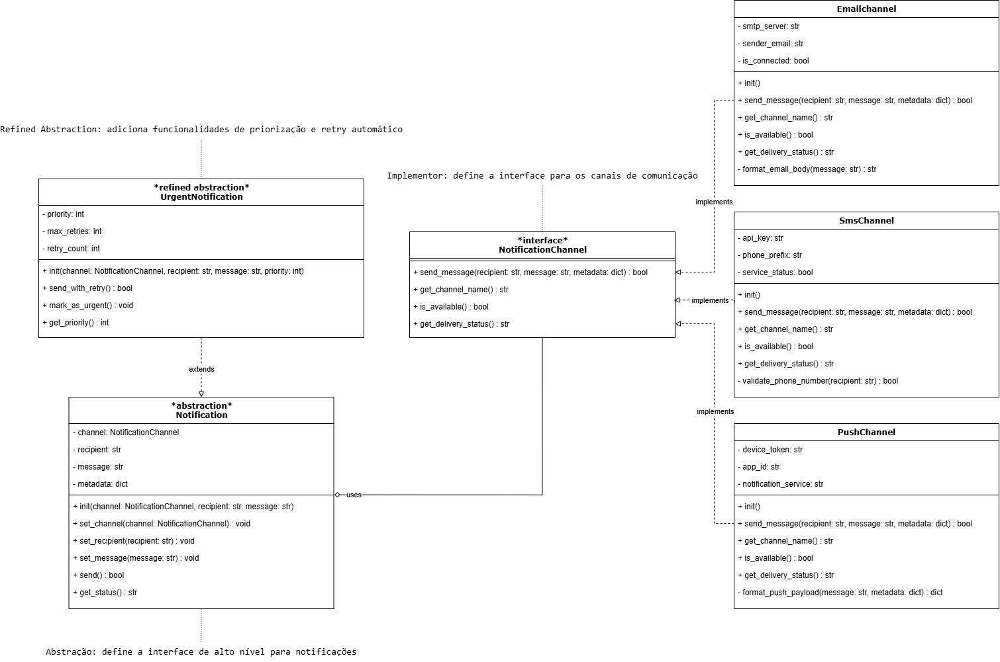

# 3.2.1. Bridge

## 1. Introdução

O padrão de projeto **Bridge** pertence ao grupo dos **padrões estruturais** propostos pela _Gang of Four (GoF)_, e tem como principal objetivo **desacoplar uma abstração de sua implementação**, permitindo que ambas possam evoluir de forma independente (GAMMA et al., 1995).  
Esse padrão é amplamente utilizado quando há a necessidade de evitar a rigidez causada pela herança direta, proporcionando maior **flexibilidade e extensibilidade** ao sistema (FREEMAN; FREEMAN, 2004).

A ideia central do Bridge é **separar a interface abstrata** (definindo o comportamento que o cliente espera) **da implementação concreta** (que realiza o comportamento específico). Isso é alcançado através de uma **ponte** que conecta os dois lados, tornando o código mais modular e de fácil manutenção (LARMAN, 2004).

## 2. Metodologia Adotada

Para o estudo e aplicação do padrão **Bridge** no contexto do **AquiTemFCTE**, adotou-se uma metodologia baseada na **análise conceitual e prática** dos princípios de design orientado a objetos descritos por Gamma et al. (1995), aliada à **comparação entre abordagens de herança e composição** conforme discutido em Freeman e Freeman (2004).  
A pesquisa compreendeu três etapas principais:

1. **Revisão teórica** dos conceitos estruturais do padrão Bridge;
2. **Identificação de um contexto de aplicação** no sistema AquiTemFCTE onde a separação entre abstração e implementação fosse relevante;
3. **Proposição e discussão da modelagem** com base em exemplos práticos de literatura e nas necessidades específicas da plataforma.

## 3. Exposição e Explicação da Modelagem

**Cenário de implementação (visão de domínio):**  
No sistema **AquiTemFCTE**, temos diferentes **tipos de notificações** que precisam ser enviadas aos usuários através de **múltiplos canais de comunicação**. Desejamos um sistema de notificações capaz de:

- Enviar diferentes tipos de mensagens: **Notificação de Produto**, **Notificação de Transação** e **Notificação de Chat**
- Utilizar múltiplos canais: **Email**, **SMS** e **Push Notification**
- Permitir **evolução independente** em dois eixos:
  - **Abstração (tipos de notificação)**: `Notification` (básica) e `UrgentNotification` (refinada, com prioridade alta)
  - **Implementação (canais)**: `EmailChannel`, `SmsChannel`, `PushChannel`
- **Troca dinâmica** do canal de envio em tempo de execução
- **Capacidades adicionais apenas na abstração refinada** (ex.: envio prioritário, retry automático)

**Mapeamento de papéis (GoF → AquiTemFCTE):**

- **Abstraction** → `Notification`
- **RefinedAbstraction** → `UrgentNotification`
- **Implementor** → `NotificationChannel` (interface)
- **ConcreteImplementor** → `EmailChannel`, `SmsChannel`, `PushChannel`

**Regras/decisões de design que sustentam o Bridge:**

- A **ponte** é a composição `Notification → NotificationChannel` (a abstração mantém uma referência para a implementação)
- `UrgentNotification` **herda** de `Notification`, preservando todos os métodos básicos e **adicionando** funcionalidades de prioridade
- **Envio com retry** é exclusivo da `UrgentNotification` para evidenciar capacidades diferenciadas na abstração refinada
- Canais não conhecem `Notification`; implementam apenas o **contrato** `NotificationChannel`
- Cada tipo de notificação formata sua mensagem de acordo com o contexto (produto, transação, chat)

**Diagrama de classes:**

<p align="center" style="font-size: 12;"><b>Figura 1:</b> Diagrama de Classes</p>

<div style="text-align: center;">



</div>

<p align="center" style="font-size: 12;"><small><b>Fonte:</b> Algusto Caldas e Eric Rabelo</small></p>

---

## 4. Exposição e Explicação da Implementação

**Resumo da miniaplicação (toy):**  
Uma **CLI em Python** demonstra o padrão Bridge no contexto do **AquiTemFCTE**, controlando o envio de notificações através de diferentes canais de comunicação.

- **Eixo da abstração:** `notification basic` ↔ `notification urgent`. A urgente **mantém** tudo da básica e **acrescenta** retry automático e priorização.
- **Eixo da implementação:** `use email|sms|push` troca o **canal** em **tempo de execução**, sem alterar o tipo de notificação.
- **Regra didática:** `send_with_retry` (envio com tentativas automáticas) é **exclusivo** da `UrgentNotification`.

**Como executar:**

1. Pré-requisito: **Python 3.10+**
2. Baixe/clone o arquivo `bridge_demo.py` no seu projeto.
3. No terminal:

   ```bash
   python bridge_aquitemfcte.py
   ```

4. Exemplos de comandos no CLI: `status`, `send`, `set_recipient joao@unb.br`, `set_message Nova venda!`, `use email`, `notification urgent`, `send_retry`, `exit`.

**Você pode encontrar o código-fonte em:** `/GOFs/Estruturais/Bridge/bridge_aquitemfcte.py`

---

## 5. Vídeo de Apresentação

<style>
.video-container {
    position: relative;
    width: 100%;
    max-width: 800px; /* Limite a largura máxima para não ficar muito grande em desktops */
    margin: 0 auto; /* Centraliza o contêiner */
    padding-bottom: 56.25%; /* Proporção 16:9 */
    height: 0;
    overflow: hidden;
}

.video-container iframe {
    position: absolute;
    top: 0;
    left: 0;
    width: 100%;
    height: 100%;
}
</style>

<div class="video-container">
<iframe width="560" height="315" src="https://www.youtube.com/embed/BvpUJUO7KeI?si=hSwRnBNFnLPE3ZAi" title="YouTube video player" frameborder="0" allow="accelerometer; autoplay; clipboard-write; encrypted-media; gyroscope; picture-in-picture; web-share" referrerpolicy="strict-origin-when-cross-origin" allowfullscreen></iframe>
</div>
---

## 6. Senso Crítico e Trabalho em Equipe

O exercício evidenciou a importância de separar **abstração** (tipos de notificação) de **implementação** (canais de envio) no contexto do AquiTemFCTE. A aplicação do padrão Bridge permitiu que o sistema de notificações fosse **extensível** sem modificar código existente: novos canais podem ser adicionados implementando apenas a interface `NotificationChannel`, e novos tipos de notificação podem herdar de `Notification` sem conhecer detalhes dos canais.

O trabalho em equipe possibilitou **revisões cruzadas** da modelagem, garantindo que o padrão fosse aplicado corretamente no contexto da plataforma. A separação clara entre abstração e implementação facilitou a divisão de tarefas (implementação de canais, tipos de notificação, CLI de demonstração) e promoveu **aprendizado coletivo** sobre princípios de design orientado a objetos.

---

## 7. Conclusão

O padrão **Bridge** mostrou-se eficaz para **reduzir acoplamento** entre o sistema de notificações (abstração) e os canais de comunicação (implementação) no AquiTemFCTE. A aplicação do padrão favoreceu **extensibilidade** (novos tipos de notificação ou canais podem ser adicionados independentemente) e **manutenibilidade** (mudanças em um eixo não afetam o outro). A miniaplicação demonstrou, de forma prática, a **evolução independente** dos dois eixos e a **troca dinâmica** de implementações em tempo de execução (GAMMA et al., 1995).

Esta abordagem é particularmente valiosa para o AquiTemFCTE, pois permite que a plataforma adapte sua estratégia de comunicação com os usuários de forma flexível, respondendo às necessidades do negócio sem reestruturação do código base.

---

## 8. Bibliografia

GAMMA, Erich et al. _Design Patterns: Elements of Reusable Object-Oriented Software._ Addison-Wesley, 1995. <br>
FREEMAN, Eric; FREEMAN, Elisabeth. _Head First Design Patterns._ O'Reilly Media, 2004.<br>
LARMAN, Craig. _Applying UML and Patterns: An Introduction to Object-Oriented Analysis and Design and Iterative Development._ 3rd ed. Prentice Hall, 2004.<br>

---

## Histórico de Versão

| Versão | Data       | Descrição                                             | Autor(es)                                       | Revisor(es)                                     | Detalhes da revisão |
| :----- | :--------- | :---------------------------------------------------- | :---------------------------------------------- | :---------------------------------------------- | :------------------ |
| 1.0    | 16/10/2025 | Inicialização do Documento                            | [Eric Rabelo](https://github.com/rabelzx)       | [Algusto Caldas](https://github.com/Algusto-RC) | Revisado e Aprovado |
| 2.0    | 16/10/2025 | Integração dos diagramas e código ao corpo do arquivo | [Algusto Caldas](https://github.com/Algusto-RC) | [Eric Rabelo](https://github.com/rabelzx)       | Revisado e Aprovado |
| 3.0    | 17/10/2025 | Adicionando vídeo de apresentação                     | [Eric Rabelo](https://github.com/rabelzx)       | [Algusto Caldas](https://github.com/Algusto-RC) | Revisado e Aprovado |
| 4.0    | 20/10/2025 | Adaptação do contexto                                 | [Algusto Caldas](https://github.com/Algusto-RC) | [Eric Rabelo](https://github.com/rabelzx)       | Revisado e Aprovado          |