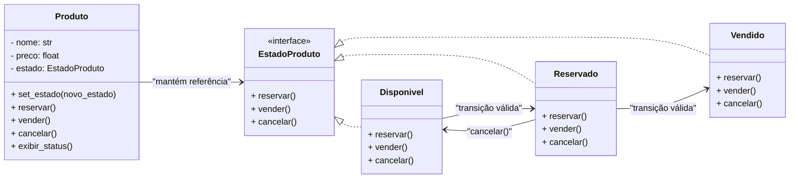
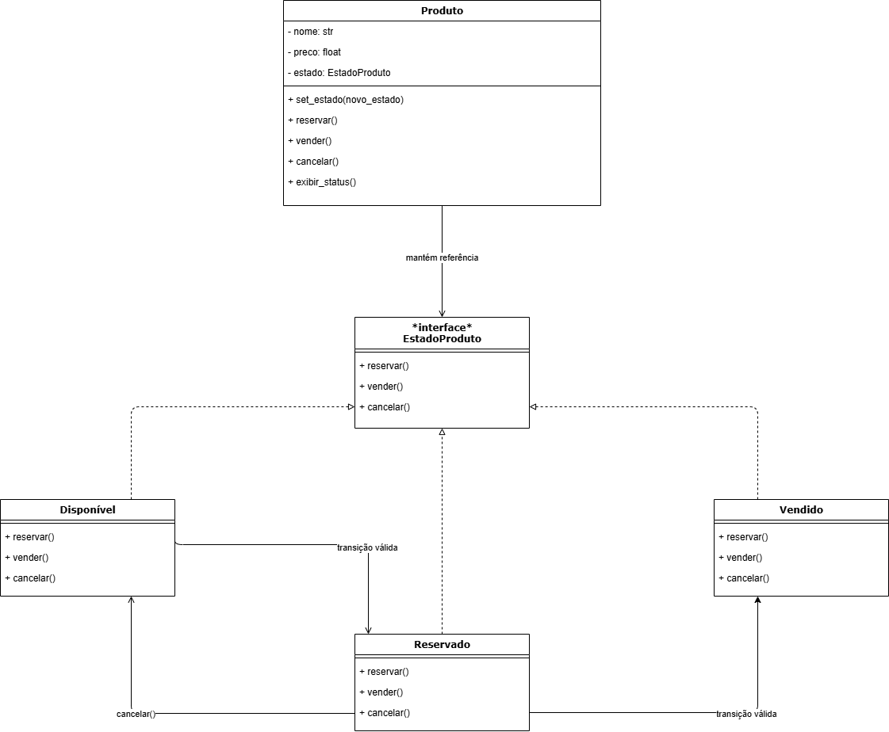

# 3.3.1. **State**

## 1. Introdução

O padrão de projeto **State** pertence ao grupo dos **padrões comportamentais** (_Behavioral Patterns_) propostos pela _Gang of Four (GoF)_.  
De acordo com (REFACTORING.GURU, 2025), o padrão **State** permite que um objeto **altere seu comportamento quando seu estado interno muda**, dando a impressão de que o objeto muda de classe.  
Esse princípio está associado ao conceito de **Máquina de Estados Finita**, na qual um objeto pode assumir um número limitado de estados e mudar dinamicamente entre eles, conforme regras pré-determinadas.

Segundo (SERRANO, 2025), os **padrões comportamentais** visam modularizar os comportamentos dos objetos, permitindo que eles **variem dinamicamente suas ações** de acordo com o contexto.  
No caso do **State**, o comportamento dependente de estado é encapsulado em **classes distintas**, o que aumenta a **extensibilidade**, a **clareza** e a **facilidade de manutenção** do código.

No contexto do **AquiTemFCTE**, esse padrão é aplicado para gerenciar os **estados de um produto** dentro da plataforma — por exemplo, **Disponível**, **Reservado** ou **Vendido** —, fazendo com que o sistema reaja de forma diferente conforme o estado atual do produto.

---

## 2. Metodologia Adotada

A documentação e a modelagem do padrão **State** no projeto **AquiTemFCTE** seguiram três etapas principais:

1. **Revisão teórica** sobre o padrão State e o conceito de máquina de estados finita, conforme (REFACTORING.GURU, 2025) e (GAMMA et al., 1995);
2. **Análise contextual** baseada nos princípios de organização de comportamento de objetos apresentados por (SERRANO, 2025);
3. **Modelagem UML e implementação prática** conforme as recomendações de (REFACTORING.GURU, 2025), priorizando o uso de composição e delegação ao invés de estruturas condicionais complexas.

---

## 3. Exposição e Explicação da Modelagem

### 3.1. Contexto no AquiTemFCTE

No **AquiTemFCTE**, os produtos passam por um **ciclo de vida controlado**, refletindo seu estado de negociação na plataforma:

- **Disponível** → Produto ativo e visível aos usuários;
- **Reservado** → Produto em negociação, aguardando confirmação;
- **Vendido** → Produto finalizado e retirado das listagens.

Conforme (REFACTORING.GURU, 2025), o padrão **State** é ideal para contextos em que **o comportamento de um objeto depende de seu estado atual**, permitindo encapsular as regras de cada situação em **classes específicas de estado**, eliminando o uso de condicionais extensas e de difícil manutenção.

No caso do AquiTemFCTE, o objeto `Produto` muda de comportamento dinamicamente conforme seu estado atual, garantindo transições seguras e previsíveis entre etapas como “Disponível → Reservado → Vendido”.

### 3.2. Mapeamento dos Papéis (GoF → AquiTemFCTE)

| Papel GoF         | Implementação no AquiTemFCTE         |
| ----------------- | ------------------------------------ |
| **Context**       | `Produto`                            |
| **State**         | `EstadoProduto` (interface)          |
| **ConcreteState** | `Disponivel`, `Reservado`, `Vendido` |

O **Contexto (`Produto`)** mantém uma referência para o estado atual e **delegará o comportamento** a esse objeto.  
Cada **estado concreto** define suas **ações válidas** e as **transições permitidas**, conforme descrito em (REFACTORING.GURU, 2025).

### 3.3. Decisões de Design

- As transições de estado são realizadas via **composição**, não por condicionais;
- Cada estado concreto define **suas próprias ações e restrições**, seguindo o princípio da **responsabilidade única** (REFACTORING.GURU, 2025);
- O `Produto` atua apenas como **intermediário**, encaminhando chamadas ao seu estado atual (`self.estado.vender()`), mantendo baixo acoplamento;
- Essa organização segue o princípio defendido por (SERRANO, 2025) de promover a **separação clara de responsabilidades** entre objetos no design comportamental.

---

## 4. Exposição e Explicação da Implementação

A implementação foi realizada em **Python**, seguindo o modelo descrito em (REFACTORING.GURU, 2025) e adaptado ao contexto do **AquiTemFCTE**.

### 4.1. Estrutura de Classes

- **`Produto`**: Contexto que mantém o estado atual e delega comportamentos;
- **`EstadoProduto`**: Interface com os métodos `reservar()`, `vender()` e `cancelar()`;
- **`Disponivel`, `Reservado`, `Vendido`**: Estados concretos com comportamentos e transições específicos.

### 4.2. Exemplo Simplificado

```python
produto = Produto("Calculadora Científica", 90.0)
produto.reservar()   # Transição para Reservado
produto.vender()     # Transição para Vendido
produto.cancelar()   # Inválido: produto já vendido
```

### 4.3. Diagrama de Classes



<p align="center" style="font-size: 12;"><b>Figura 1:</b> Diagrama de Classes - Padrão State</p>

<div align="center">



</div>

<p align="center" style="font-size: 12;"><small><b>Fonte:</b> Algusto Caldas e Eric Rabelo</small></p>

---

## 5. Aplicação Didática (Miniaplicação)

Foi desenvolvida uma **miniaplicação em Python** (`state_aquitemfcte.py`) para ilustrar o uso do padrão **State** no **AquiTemFCTE**.  
A aplicação permite alterar o estado de produtos e visualizar as ações disponíveis em cada fase do ciclo de vida.

**Execução:**

```bash
python state_demo.py
```

**Funcionalidades:**

- Transições válidas e bloqueio de ações inválidas;
- Exibição de mensagens distintas conforme o estado atual;
- Demonstração prática da **máquina de estados finita** descrita por (REFACTORING.GURU, 2025).

---

## 6. Senso Crítico e Trabalho em Equipe

O desenvolvimento deste módulo reforçou as vantagens apresentadas por (REFACTORING.GURU, 2025): o padrão **State** permite **organizar comportamentos** por estado, **reduzir o acoplamento** e **eliminar condicionais extensos**.

Inspirados pela abordagem de (SERRANO, 2025), a equipe estruturou o código de forma colaborativa, dividindo responsabilidades entre a definição de estados, contextos e fluxos de transição, o que reforçou a importância da **clareza arquitetural** e da **coerência no design de software**.

---

## 7. Conclusão

A aplicação do padrão **State** no sistema **AquiTemFCTE** comprovou que o comportamento de um objeto pode **mudar dinamicamente conforme seu estado interno**, sem depender de estruturas rígidas de decisão.  
Assim como proposto por (REFACTORING.GURU, 2025), essa abordagem favorece a **organização**, a **extensibilidade** e a **evolução incremental** do sistema.  
O modelo também reflete os princípios enfatizados por (SERRANO, 2025), garantindo **coesão e clareza** na definição dos comportamentos do sistema.

---

## 8. Bibliografia

- GAMMA, Erich et al. _Design Patterns: Elements of Reusable Object-Oriented Software._ Addison-Wesley, 1995.
- [REFACTORING.GURU. “Padrão State”](https://refactoring.guru/pt-br/design-patterns/state). Acesso em: 23 out. 2025.
- [SERRANO, Milene. “Arquitetura e Desenho de Software - Aula GoFs Comportamentais - UnB”](https://aprender3.unb.br/pluginfile.php/3178544/mod_page/content/1/Arquitetura%20e%20Desenho%20de%20Software%20-%20Aula%20GoFs%20Estruturais%20-%20Profa.%20Milene.pdf). Acesso em: 23 out. 2025.

---

## Histórico de Versões

| Versão | Data       | Descrição                                          | Autor(es)                                       | Revisor(es)                                     | Detalhes da revisão |
| :----- | :--------- | :------------------------------------------------- | :---------------------------------------------- | :---------------------------------------------- | :------------------ |
| 1.0    | 23/10/2025 | Criação inicial do documento State                 | [Eric Rabelo](https://github.com/rabelzx)       | [Algusto Caldas](https://github.com/Algusto-RC) | Revisado e Aprovado |
| 2.0    | 23/10/2025 | Citações corrigidas e adequadas às fontes oficiais | [Algusto Caldas](https://github.com/Algusto-RC) | [Eric Rabelo](https://github.com/rabelzx)       | Revisado e Aprovado |
| 3.0    | 23/10/2025 | Adicionando diagrama                               | [Algusto Caldas](https://github.com/Algusto-RC) | [Eric Rabelo](https://github.com/rabelzx)       | Revisado e Aprovado |
