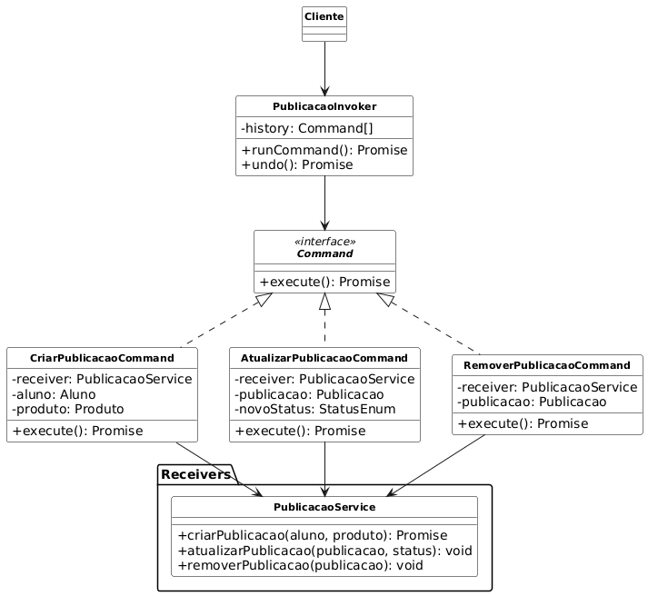

# 3.3.5  Command

## 1. Introdução

Este documento apresenta a aplicação do padrão de projeto comportamental Command, um dos GoF Comportamentais, no contexto do sistema de trocas e vendas entre alunos. 

A utilização do padrão Command neste projeto visa encapsular operações do domínio, como publicação, edição, remoção e alteração de status de produtos, em objetos de comando independentes, permitindo maior flexibilidade, desacoplamento entre interface e lógica de negócio e suporte a funcionalidades como histórico de ações, execução em fila e possibilidade de desfazer operações (REFACTORING GURU, 2025).

## 2. Metodologia

A escolha do padrão Command se justifica pela necessidade de desacoplar a execução das operações da sua solicitação, permitindo maior flexibilidade e clareza na estrutura do código. Essa abordagem também possibilita registrar histórico de ações, executar comandos de forma sequencial e, futuramente, implementar mecanismos de desfazer operações, caso necessário (SERRANO, 2025).

Com base nessa estratégia, foram implementadas classes específicas para cada tipo de comando, além de um invocador responsável por gerenciar a execução e o armazenamento das ações realizadas dentro do sistema AquiTemFCTE.

- Utilização do diagrama de classes, que serviu como base para estruturar os elementos envolvidos no padrão, suas relações e hierarquias.
- Foram utilizados os materiais fornecidos pela professora para o desenvolvimento do tópico, como slides, videoaulas e exemplo de implementação em Java (SERRANO, 2025).
- O diagrama mostrado a seguir foi modelado através da ferramenta draw.io, o que auxiliou diretamente na visualização clara da composição dos objetos, seus relacionamentos e hierarquia.
- A implementação foi realizada com `Typescript`, por ser uma linguagem orientada a objetos.

## 3. Participantes

Os participantes da implementação deste Padrão de Projeto estão descritos na tabela abaixo:

<p style="text-align: center;">Tabela 1: Participantes da implementação do Command</p>

|Matrícula | Aluno |
| -- | -- |
| 23/1026302  |  Caio Sabino  |
| 23/1011328  |  Felipe Campelo        |

## 4. Diagramação

<p align="center"><small>Figura 1 - Diagrama de Classes do Padrão Command.</small></p>



<p align="center"><small>Fonte: Caio Sabino e Felipe Campelo.</small></p>

## 5. Desenvolvimento

O objetivo principal é encapsular todos os dados necessários para executar uma ação em um único objeto (REFACTORING GURU, 2025).

Essa abordagem resolve um problema muito comum: ela desacopla o objeto que solicita uma ação do objeto que sabe como executar essa ação.


### Principais benefícios implementados

1. **Desacoplamento:** o `PublicacaoInvoker` não possui conhecimento sobre o `PublicacaoService`. Ele apenas sabe como executar ou desfazer comandos.  
2. **Encapsulamento:** cada comando (`CriarPublicacaoCommand`, `AtualizarPublicacaoCommand`) contém todas as informações necessárias para sua execução, incluindo referência ao serviço e os dados relevantes (aluno, produto, status, etc.).  

### Os Participantes do Padrão 

Vamos analisar como cada arquivo se encaixa nesse padrão:

* **Command (Interface):** `Command.ts`
* **ConcreteCommand (Comandos Concretos):** `CriarPublicacaoCommand.ts`, `AtualizarPublicacaoCommand.ts`, `RemoverPublicacaoCommand.ts`
* **Receiver (Receptor):** `PublicacaoService.ts` 
* **Invoker (Invocador):** `PublicacaoInvoker.ts` 
* **Client (Cliente):** `main.ts` 
* **Modelos:** `Aluno.ts`, `Produto.ts`, `Publicacao.ts`, `enums.ts` 

### Estrutura das pastas
```sql
GOFs/
└── Comportamental/
    └── Command/
        ├── commands/
        │   ├── CriarPublicacaoCommand.ts
        │   ├── AtualizarPublicacaoCommand.ts
        │   └── RemoverPublicacaoCommand.ts
        ├── invoker/
        │   └── PublicacaoInvoker.ts
        ├── services/
        │   └── PublicacaoService.ts
        ├── models/
        │   ├── Aluno.ts
        │   ├── Produto.ts
        │   ├── Publicacao.ts
        │   └── enums.ts
        ├── main.ts
        ├── package.json
        └── tsconfig.json

```

[Clique aqui para acessar o código no repositório](https://github.com/UnBArqDsw2025-2-Turma02/2025.2_T02_G6_AquiTemFCTE_Entrega_03/tree/main/GOFs/Comportamental/Command)

### Models

Essa pasta representa os dados da aplicação, utilizados segundo o diagrama de classes. Eles são essenciais para o desenvolvimento do Command. O enum é utilizado para o status da publicação, que pode ser alterado através de comandos.

#### Aluno

```typescript
// models/Aluno.ts
import {Produto} from "./Produto";

export class Aluno{
    constructor(public nome: string, public email: string){}

    publicarProduto(produto: Produto): void{
        console.log(`${this.nome} publicou o produto ${produto.nome}`);
    }
}
```
#### Produto
```typescript
// models/Produto.ts
export class Produto{
    constructor(public nome: string, public preco: number, public descricao: string){};
}
```

#### Publicação
```typescript
// models/Publicacao.ts
import {Produto} from "./Produto";
import {Aluno} from "./Aluno";
import { StatusEnum } from "./enums";

export class Publicacao{
    private status: StatusEnum;

    constructor(public produto: Produto, public aluno: Aluno){
        this.status = StatusEnum.Disponivel;
    }

    mudarStatus(status: StatusEnum): void{
        this.status = status;
        console.log(`Status da publicação do aluno ${this.aluno.nome} do produto
            ${this.produto.nome} agora é ${status}`);
    }

    getStatus(): StatusEnum{
        return this.status;
    }
}
```
#### Enum
```typescript
// models/enums.ts
export enum StatusEnum {
    Disponivel = "Disponível",
    Indisponivel = "Indisponível",
}
```

### Receiver

A classe Receiver executa as ações de negócio, comandado pela classe Command.


#### PublicacaoService
```typescript

// services/PublicacaoService.ts
import { Aluno } from "../models/Aluno";
import { Produto } from "../models/Produto";
import { Publicacao } from "../models/Publicacao";
import { StatusEnum } from "../models/enums";

export class PublicacaoService {
  private publicacoes: Publicacao[] = [];

  criarPublicacao(aluno: Aluno, produto: Produto): Publicacao {
    const publicacao = new Publicacao(produto, aluno);
    this.publicacoes.push(publicacao);
    aluno.publicarProduto(produto);
    console.log("✅ Publicação criada com sucesso!");
    return publicacao;
  }

  atualizarPublicacao(publicacao: Publicacao, novoStatus: StatusEnum): void {
    publicacao.mudarStatus(novoStatus);
    console.log("🔄 Publicação atualizada!");
  }

  removerPublicacao(publicacao: Publicacao): void {
    publicacao.mudarStatus(StatusEnum.Indisponivel);
    console.log("❌ Publicação removida!");
  }
}
```

### Command

Esta é a parte central do padrão. Inclui a Interface Command, que define um contrato, e os Concrete Commands, que encapsulam uma solicitação específica.

- O Command.ts é a interface que padroniza todas as execuções nos métodos `execute()` e `undo()`.
- As outras classes presentes na mesma pasta são os Concrete Commands, que tem como função encapsular uma solicitação.

#### Command
```typescript
// commands/Command.ts
export interface Command {
  execute(): void;
  undo(): void; // opcional, mas útil em sistemas reais
}
```
#### AtualizarPublicacaoCommand
```typescript
// commands/AtualizarPublicacaoCommand.ts
import { Command } from "./Command";
import { PublicacaoService } from "../services/PublicacaoService";
import { Publicacao } from "../models/Publicacao";
import { StatusEnum } from "../models/enums";

export class AtualizarPublicacaoCommand implements Command {
  constructor(
    private service: PublicacaoService,
    private publicacao: Publicacao,
    private novoStatus: StatusEnum
  ) {}

  execute(): void {
    this.service.atualizarPublicacao(this.publicacao, this.novoStatus);
  }

  undo(): void {
    this.service.atualizarPublicacao(this.publicacao, StatusEnum.Disponivel);
    console.log("↩️ Ação desfeita: status voltou para disponível.");
  }
}
```
#### CriarPublicacaoCommand
```typescript
// commands/CriarPublicacaoCommand.ts
import { Command } from "./Command";
import { PublicacaoService } from "../services/PublicacaoService";
import { Aluno } from "../models/Aluno";
import { Produto } from "../models/Produto";
import { Publicacao } from "../models/Publicacao";

export class CriarPublicacaoCommand implements Command {
  private publicacao?: Publicacao;

  constructor(
    private service: PublicacaoService,
    private aluno: Aluno,
    private produto: Produto
  ) {}

  execute(): void {
    this.publicacao = this.service.criarPublicacao(this.aluno, this.produto);
  }

  undo(): void {
    if (this.publicacao) {
      this.service.removerPublicacao(this.publicacao);
      console.log("↩️ Ação desfeita: publicação removida.");
    }
  }
}
```
#### RemoverPublicacaoCommand
```typescript
// commands/RemoverPublicacaoCommand.ts
import { Command } from "./Command";
import { PublicacaoService } from "../services/PublicacaoService";
import { Publicacao } from "../models/Publicacao";

export class RemoverPublicacaoCommand implements Command {
  constructor(private service: PublicacaoService, private publicacao: Publicacao) {}

  execute(): void {
    this.service.removerPublicacao(this.publicacao);
  }

  undo(): void {
    console.log("↩️ (Simulação) Publicação restaurada!");
  }
}
```

### Invoker

O Invoker é o objeto que dispara a ação. Ele é associado a um comando e o executa. Ele não sabe o que o comando faz, apenas como executá-lo.

### PublicacaoInvoker

```typescript
// invoker/PublicacaoInvoker.ts
import { Command } from "../commands/Command";

export class PublicacaoInvoker {
  private historico: Command[] = [];

  executar(command: Command): void {
    command.execute();
    this.historico.push(command);
  }

  desfazerUltimo(): void {
    const ultimo = this.historico.pop();
    if (ultimo) ultimo.undo();
  }
}
```

### Cliente

Essa classe define qual comando executar e quando, foi utilizada como classe de teste.


#### Main
```typescript
// main.ts
import { Aluno } from "./models/Aluno";
import { Produto } from "./models/Produto";
import { PublicacaoService } from "./services/PublicacaoService";
import { CriarPublicacaoCommand } from "./commands/CriarPublicacaoCommand";
import { AtualizarPublicacaoCommand } from "./commands/AtualizarPublicacaoCommand";
import { RemoverPublicacaoCommand } from "./commands/RemoverPublicacaoCommand";
import { PublicacaoInvoker } from "./invoker/PublicacaoInvoker";
import { StatusEnum } from "./models/enums";

// Simula o fluxo do app
const aluno = new Aluno("Caio", "caio@email.com");
const produto = new Produto("Violão", 500, "Instrumento usado");
const service = new PublicacaoService();
const invoker = new PublicacaoInvoker();

//  Criar publicação
const criarCmd = new CriarPublicacaoCommand(service, aluno, produto);
invoker.executar(criarCmd);

//  Atualizar status
const publicacao = service["publicacoes"][0];
const atualizarCmd = new AtualizarPublicacaoCommand(service, publicacao, StatusEnum.Indisponivel);
invoker.executar(atualizarCmd);

//  Remover publicação
const removerCmd = new RemoverPublicacaoCommand(service, publicacao);
invoker.executar(removerCmd);

//  Desfazer última ação
invoker.desfazerUltimo();
```

### Como executar o código?

#### Passo 1: Acesse o diretório do Projeto:

```shell
cd GOFs/Comportamentais/Command
```

#### Passo 2: Instale as dependências do Projeto:

```shell
npm install 
```

#### Passo 3: Execute o projeto:

```shell
npm start
```


## 6. Vídeo do código rodando

<p align="center"><small>Vídeo 1 - Código Command (Fonte: Caio Sabino).</small></p>

<div align="center">
  <iframe 
    width="560" 
    height="315" 
    src="https://www.youtube.com/embed/7hXbFJShbik" 
    title="Command - AquiTemFCTE" 
    frameborder="0" 
    allow="accelerometer; autoplay; clipboard-write; encrypted-media; gyroscope; picture-in-picture; web-share" 
    allowfullscreen>
  </iframe>
</div>


## 7. Senso Crítico e Trabalho em Equipe

### Justificativas e Senso Crítico

Foi feita uma análise detalhada do projeto para projetar a viabilidade da aplicação desse padrão de projeto no AquiTemFCTE, pois este, por muitas vezes, não se encaixa em alguns projetos por sua complexidade. Essa análise foi essencial para entendermos como esse design pattern é importante e o quanto ele facilita a implementação e entendimento do projeto.


## 8. Conclusão

Em conclusão, a aplicação do padrão Command no projeto foi eficaz ao transformar solicitações de negócios em objetos independentes.

O principal benefício alcançado foi o desacoplamento entre a camada que inicia a ação e a camada que executa a lógica de negócios.

Essa arquitetura não apenas tornou o código mais flexível, mas também viabilizou, de forma natural, a implementação de funcionalidades complexas, como um histórico de ações e a capacidade de desfazer, que foram centralizadas no Invocador. A simulação final validou como esses componentes interagem de forma coesa, permitindo a execução e a reversão de operações.

## 9. Referências

> REFACTORING GURU. **Command design pattern**. Disponível em: https://refactoring.guru/design-patterns/command. Acesso em: 23 out. 2025.

> SERRANO, Milene, Arquitetura e Desenho de Software - Aula - GOFS Comportamentais. Disponível em: https://aprender3.unb.br/pluginfile.php/3178544/mod_page/content/1/Arquitetura%20e%20Desenho%20de%20Software%20-%20Aula%20GoFs%20Estruturais%20-%20Profa.%20Milene.pdf. Universidade de Brasília - UnB. Brasília. Acesso em 23 de outubro de 2025.

## Histórico de Versões

| Versão | Data       | Descrição                              | Autor(es)                                           | Revisor(es)                                         | Detalhes da Revisão                      |
| ------ | ---------- | -------------------------------------- | --------------------------------------------------- | --------------------------------------------------- | ---------------------------------------- |
| 1.0    | 23/10/2025 | Início documentação                   | [Felipe Campelo](https://github.com/felipeacampelo) | [Caio Sabino](https://github.com/caiomsabino) |Adicionar o resto das coisas. |
| 1.1   | 23/10/2025 | Refatoração da documentação, inserção dos códigos e inserção de vídeo. | [Caio Sabino](https://github.com/caiomsabino) | [Felipe Campelo](https://github.com/felipeacampelo) | Adicionar diagrama |
| 1.2   | 23/10/2025 | Adiciona diagrama e referências | [Felipe Campelo](https://github.com/felipeacampelo) | [Caio Sabino](https://github.com/caiomsabino) | |
