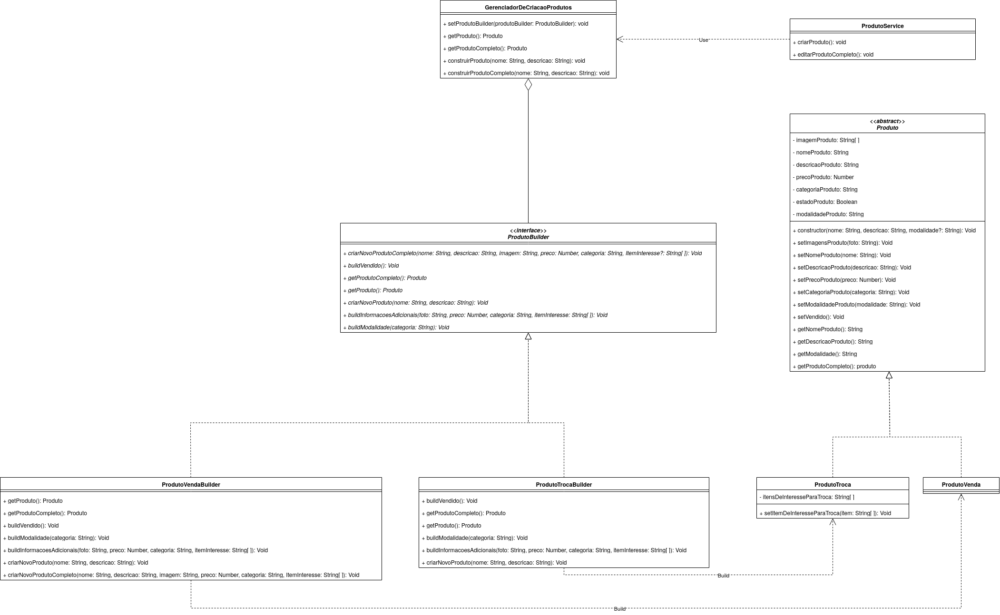
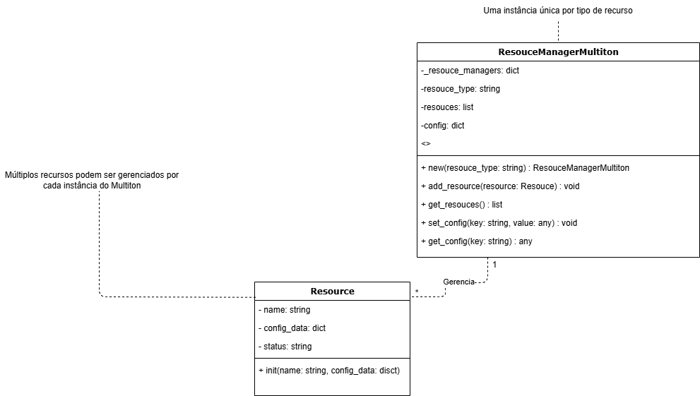
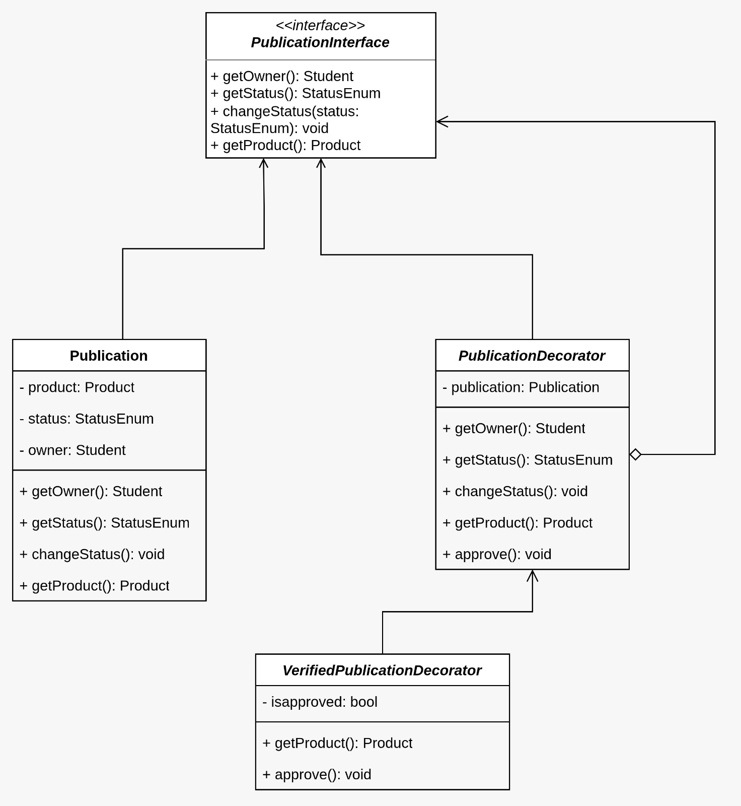

# AquiTemFCTE

**Código da Disciplina**: FGA0208<br>
**Número do Grupo**: 06<br>
**Entrega**: 03<br>

## Alunos

| Matrícula  | Aluno             |
| ---------- | ----------------- |
| 20/2017521 | Algusto Rodrigues |
| 23/1026302 | Caio Lucas        |
| 21/1061583 | Daniel Rodrigues  |
| 23/1011220 | Davi Camilo       |
| 21/1030729 | Eric Rabelo       |
| 23/1011328 | Felipe Campelo    |
| 21/1061897 | Igor Justino      |
| 23/1011515 | Isaque Camargos   |
| 22/2015159 | Lucas Guimarães   |
| 23/1026750 | Ludmila Aysha     |

## Sobre

O AquiTemFCTE é uma plataforma digital que busca atender às necessidades da comunidade universitária da Universidade de Brasília (UnB) do Campus Faculdade de Ciências e Tecnologias em Engenharia (FCTE). Nosso principal objetivo é facilitar a compra, venda e troca de itens novos e usados exclusivamente entre os estudantes da universidade, criando um ambiente seguro e confiável para transações.

O projeto foi concebido no âmbito da disciplina de Arquitetura e Desenho de Software (UnB - 2025.2) e visa solucionar a dificuldade que muitos alunos têm em encontrar canais confiáveis para negociar produtos dentro do próprio campus. A plataforma centraliza essas atividades e otimiza a experiência do usuário, oferecendo recursos de pesquisa, categorização de produtos e perfis de usuário verificados.

## Screenshots da Terceira Entrega

### 1. GOF Builder



### 2. GOF Multiton



### 3. GOF Decorator



## Há algo a ser executado?

(x) SIM

( ) NÃO

## Como Executar os Códigos dos Padrões GOF

### 🏗️ GOF Builder (TypeScript/Node.js)

**Localização:** `GOFs/Criacionais/Builder/`

**Pré-requisitos:**

- Node.js (versão 16 ou superior)
- npm (gerenciador de pacotes do Node.js)

**Instruções:**

```bash
# Navegue até o diretório
cd GOFs/Criacionais/Builder

# Instale as dependências
npm install

# Execute o servidor
npm start
```

O servidor será iniciado na porta 3000. Acesse `http://localhost:3000` para interagir com a API que demonstra o padrão Builder.

---

### 🔗 GOF Multiton (Python)

**Localização:** `GOFs/Criacionais/Multiton/`

**Pré-requisitos:**

- Python 3.8 ou superior

**Instruções:**

```bash
# Navegue até o diretório
cd GOFs/Criacionais/Multiton

# Execute o script
python multiton_demo.py
```

A aplicação apresentará um menu interativo com opções para demonstrar o padrão Multiton.

---

### 🏭 GOF Factory Method (Python/Django)

**Localização:** `GOFs/Criacionais/FactoryMethod/`

**Pré-requisitos:**

- Python 3.8 ou superior
- Django

**Instruções:**

```bash
# Navegue até o diretório
cd GOFs/Criacionais/FactoryMethod

# Crie um ambiente virtual (recomendado)
python3 -m venv venv
source venv/bin/activate  # No Windows: venv\Scripts\activate

# Instale as dependências
pip install -r requirements.txt

# Execute as migrações
python manage.py migrate

# Execute os testes
python manage.py test user.tests -v 2
```

---

### 🏭 GOF Abstract Factory (TypeScript/Node.js)

**Localização:** `GOFs/Criacionais/AbstractFactory/`

**Pré-requisitos:**

- Node.js (versão 16 ou superior)
- npm

**Instruções:**

```bash
# Navegue até o diretório
cd GOFs/Criacionais/AbstractFactory

# Instale as dependências
npm install

# Execute o código
npm start
```

---

### 🔄 GOF Singleton (Python)

**Localização:** `GOFs/Criacionais/Singleton/`

**Pré-requisitos:**

- Python 3.8 ou superior

**Instruções:**

```bash
# Navegue até o diretório
cd GOFs/Criacionais/Singleton

# Execute o script
python singleton_demo.py
```

---

### 🎨 GOF Decorator (Python/Django)

**Localização:** `GOFs/Estruturais/Decorator/`

**Pré-requisitos:**

- Python 3.8 ou superior
- Django

**Instruções:**

```bash
# Navegue até o diretório
cd GOFs/Estruturais/Decorator

# Crie um ambiente virtual
python3 -m venv .venv
source .venv/bin/activate  # No Windows: .venv\Scripts\activate

# Instale as dependências
pip install -r requirements.txt

# Execute as migrações
python manage.py migrate

# Execute os testes
python manage.py test publication -v 2
```

---

### 🌉 GOF Bridge (Python)

**Localização:** `GOFs/Estruturais/Bridge/`

**Pré-requisitos:**

- Python 3.8 ou superior

**Instruções:**

```bash
# Navegue até o diretório
cd GOFs/Estruturais/Bridge

# Execute o script
python bridge_aquitemfcte.py
```

---

### 🔧 GOF Adapter (Python)

**Localização:** `GOFs/Estruturais/adapter/`

**Pré-requisitos:**

- Python 3.8 ou superior

**Instruções:**

```bash
# Navegue até o diretório
cd GOFs/Estruturais/adapter

# Execute o script
python adapter_demo.py
```

---

### 🛡️ GOF Proxy (Python)

**Localização:** `GOFs/Estruturais/proxy/`

**Pré-requisitos:**

- Python 3.8 ou superior

**Instruções:**

```bash
# Navegue até o diretório
cd GOFs/Estruturais/proxy

# Execute o script
python proxy_demo.py
```

---

### 🌳 GOF Composite (TypeScript/Node.js)

**Localização:** `GOFs/Estruturais/Composite/`

**Pré-requisitos:**

- Node.js (versão 16 ou superior)
- npm

**Instruções:**

```bash
# Navegue até o diretório
cd GOFs/Estruturais/Composite

# Instale as dependências
npm install

# Execute o código
npm start
```

---

### 🎭 GOF State (Python)

**Localização:** `GOFs/Comportamental/State/`

**Pré-requisitos:**

- Python 3.8 ou superior

**Instruções:**

```bash
# Navegue até o diretório
cd GOFs/Comportamental/State

# Execute o script
python state_demo.py
```

---

### 🔄 GOF Iterator (TypeScript/Node.js)

**Localização:** `GOFs/Comportamental/Iterator/`

**Pré-requisitos:**

- Node.js (versão 16 ou superior)
- npm

**Instruções:**

```bash
# Navegue até o diretório
cd GOFs/Comportamental/Iterator

# Instale as dependências
npm install

# Execute o código
npm run dev
```

---

## Informações Complementares

Nenhuma informação complementar.

## Histórico de Versões

| Versão | Data       | Descrição                                   | Autor(es)                                         | Revisor(es)                                      | Detalhes da Revisão                |
| ------ | ---------- | ------------------------------------------- | ------------------------------------------------- | ------------------------------------------------ | ---------------------------------- |
| 1.0    | 12/10/2025 | Criação do Documento                        | [Daniel Rodrigues](https://github.com/DanielRogs) | [Ludmila Nunes](https://github.com/ludmilaaysha) | Sem erros identificados na revisão |
| 2.0    | 24/10/2025 | Adiciona Screenshots e execução dos códigos | [Daniel Rodrigues](https://github.com/DanielRogs) | [Ludmila Nunes](https://github.com/ludmilaaysha) | Sem erros identificados na revisão |
